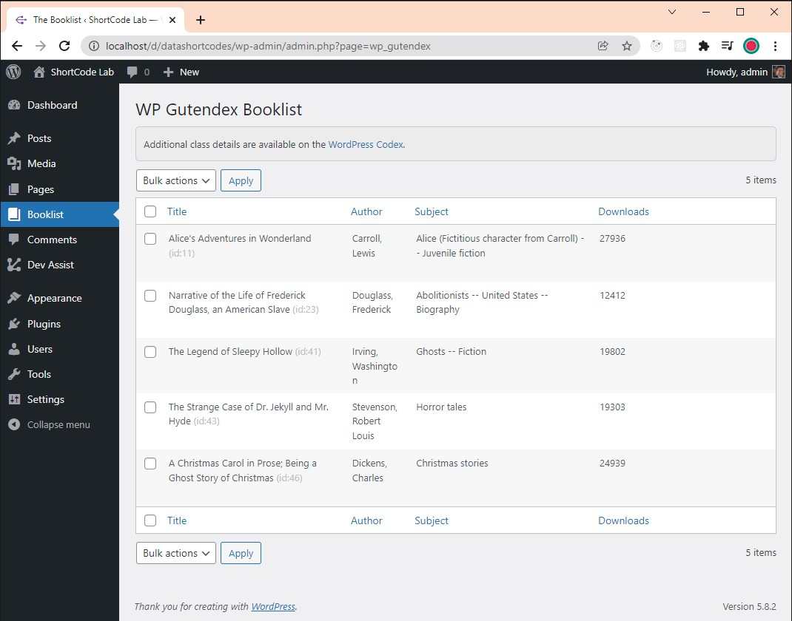

# WP Gutendex

## Gutenburg > Gutendex API > WordPress

Plugin to create 'books' custom table and insert book records GET via Gutendex API. Removes the table on uninstall.

https://github.com/garethbjohnson/gutendex

# Packets from Gutendex

How to decrypt HTTPS traffic with Wireshark is here. https://www.youtube.com/watch?v=5qecyZHL-GU

See the image for API calls to Gutendex.

# On Activation

On plugin activation, a custom WordPress table is created and automatically populated from the Gutendex API data.

# Admin Table

WordPress admin table is created by extending the WP_List_Table Class

https://developer.wordpress.org/reference/classes/wp_list_table/

